# Auto-Temperature-Controller-Verilog

# Automatic Temperature Controller using Verilog (FSM Design)

## Overview

This project implements an **Automatic Temperature Controller** using **Verilog HDL**.
The design controls the **Heater** and **Cooler** automatically based on the **Current Temperature**, **Desired Temperature**, and **Temperature Tolerance** using **Finite State Machine (FSM)** logic.

The design is simulated and synthesized using **Xilinx Vivado**.

---

# Architecture

The Automatic Temperature Controller consists of:

1. Temperature Comparison Logic
2. FSM-based State Controller
3. Heater Control
4. Cooler Control

The controller continuously compares temperature values and decides whether to turn ON the heater, turn ON the cooler, or remain in idle mode.

---

# Block Diagram

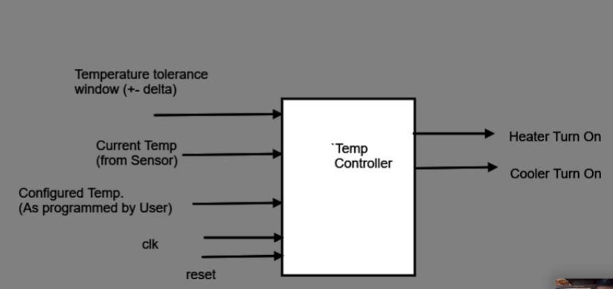

---

# Circuit Diagram

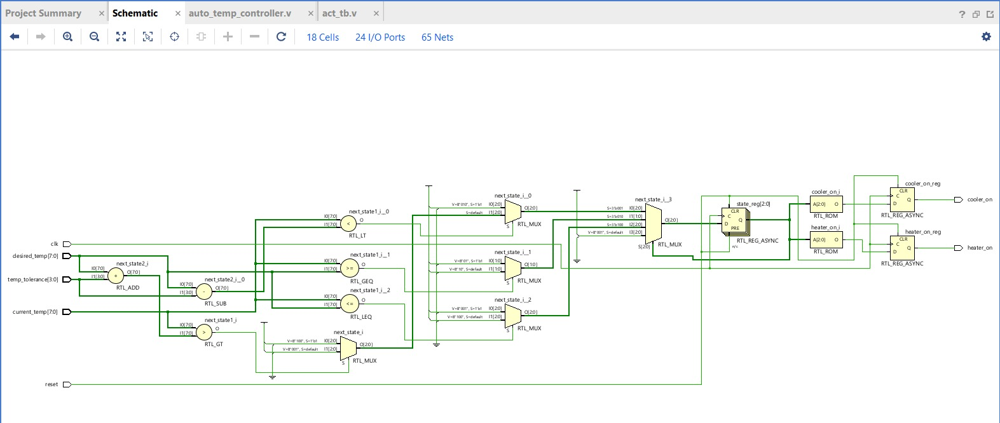

---

# FSM Design

The controller operates using 3 FSM states:

```text
IDLE → HEATING → COOLING → IDLE
```

### States

* IDLE
* HEATING
* COOLING

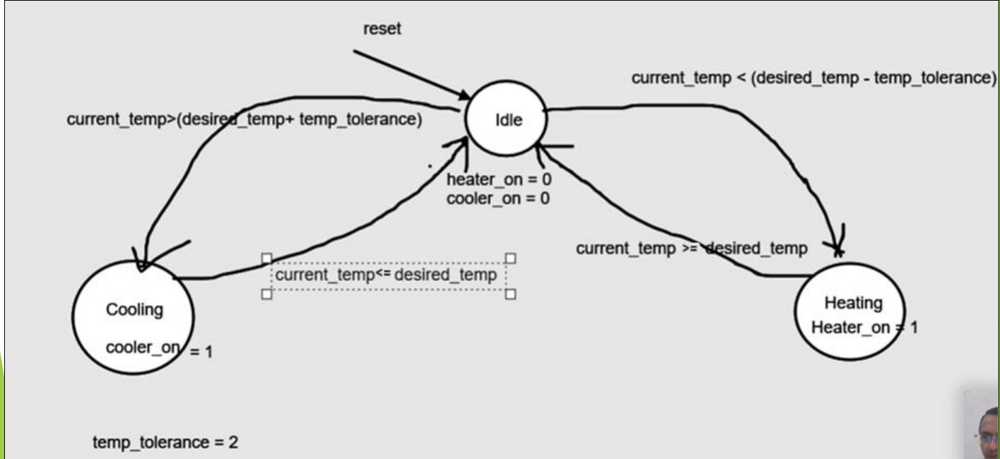

---

# RTL Module

### Automatic Temperature Controller

Controls heater and cooler based on temperature conditions.

### Inputs

* clk
* reset
* current_temp
* desired_temp
* temp_tolerance

### Outputs

* heater_on
* cooler_on

---

# Testbench

The testbench verifies different temperature conditions such as:

* Heating condition
* Cooling condition
* Idle condition

It checks whether the heater and cooler turn ON/OFF correctly based on temperature values.

---

# Simulation Result

Temperature control functionality verified in Vivado simulator.

### Example Cases

| Current Temp | Desired Temp | Result    |
| ------------ | -----------: | --------- |
| 65           |           70 | Heater ON |
| 72           |           70 | Cooler ON |
| 70           |           70 | Idle      |
| 50           |           70 | Heater ON |
| 90           |           70 | Cooler ON |

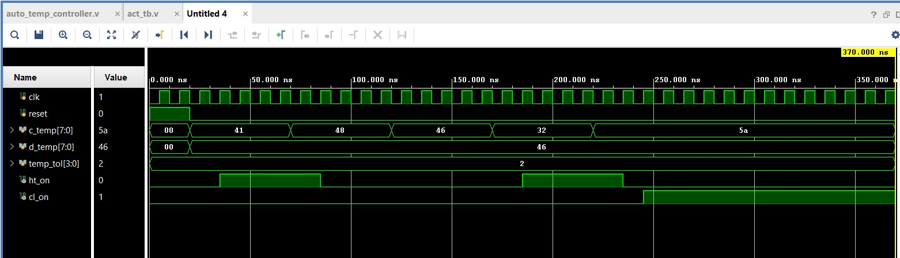

---

# TCL Console Result

Simulation output verified using TCL Console.

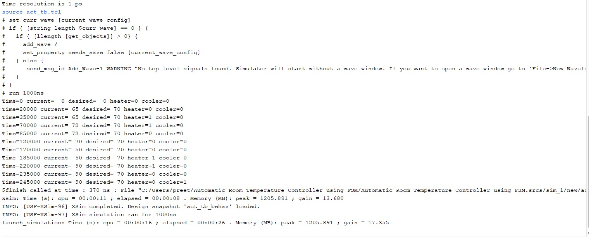

---

# Synthesis Results

RTL schematic generated by Vivado.

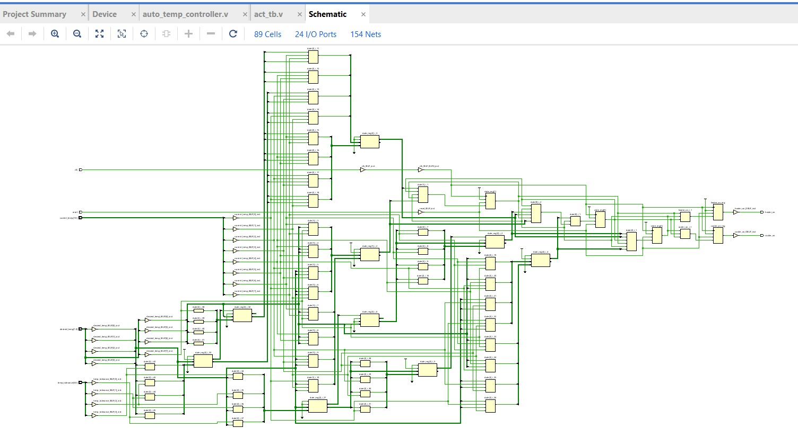

Device utilization and implementation view.

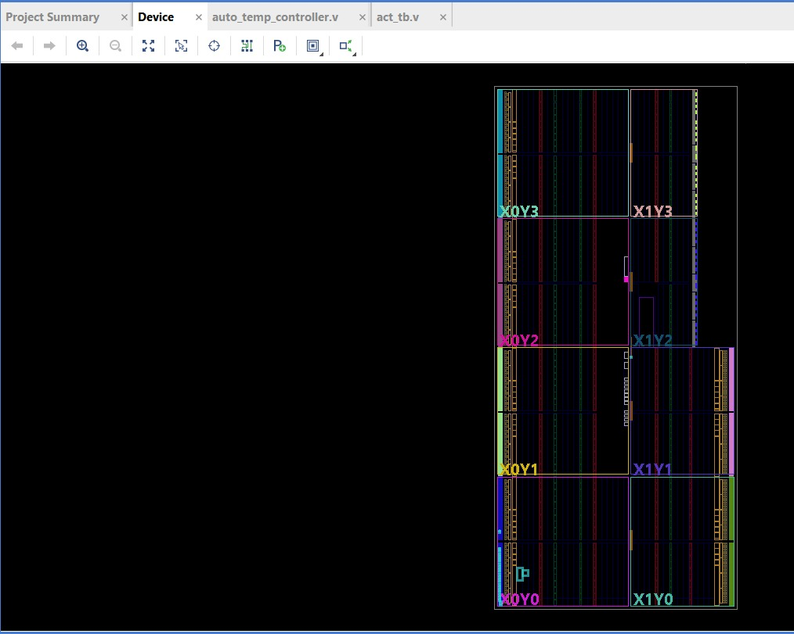

---

# Results and Analysis Reports

## Design Runs

* synth_design Complete
* route_design Complete

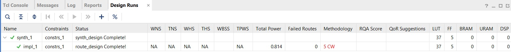

---

## Resource Utilization

* LUT : 37
* FF : 5
* BRAM : 0
* DSP : 0

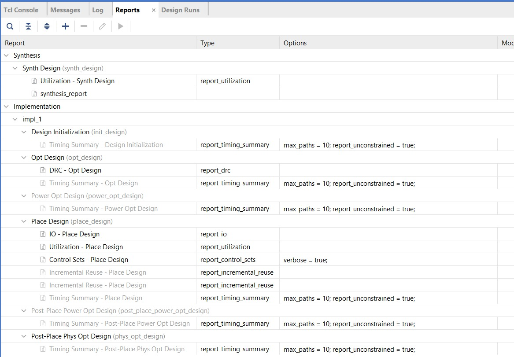

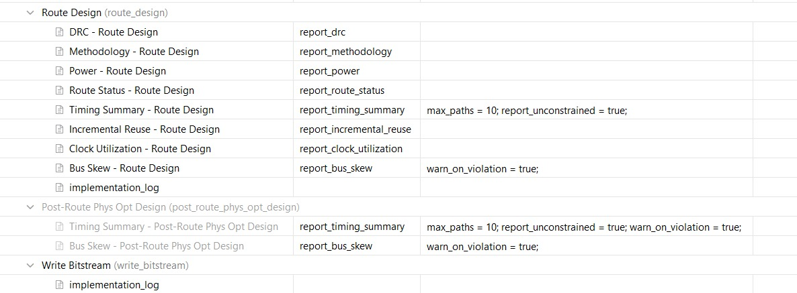

---

## Timing Analysis

* No failing endpoints
* Total Negative Slack (TNS) = 0
* Total Hold Slack (THS) = 0

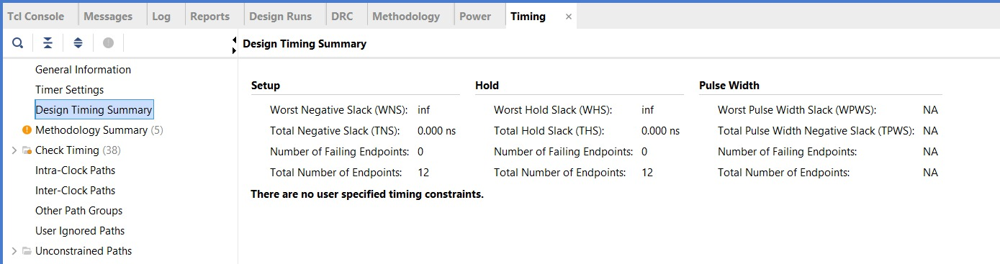

---

# Power Analysis

Total On-Chip Power

```text
0.811 W
```

Dynamic Power

```text
0.728 W
```

Device Static Power

```text
0.083 W
```

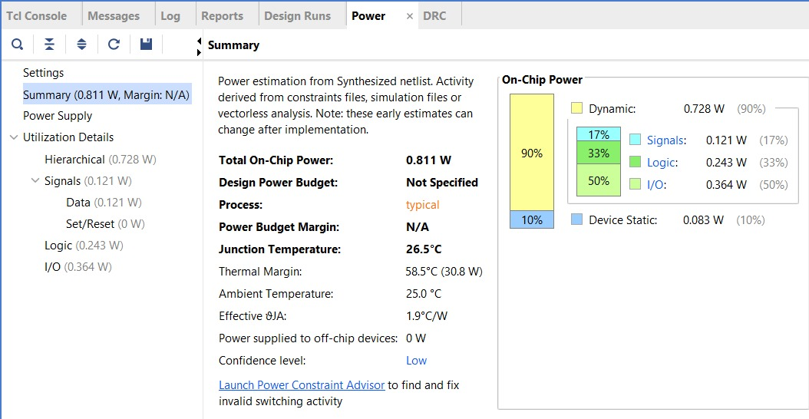

---

# Tools Used

* Verilog HDL
* Xilinx Vivado
* FPGA synthesis tools
* FSM-based Digital Design

---

# Applications

This controller is widely used in:

* Smart Home Automation
* HVAC Systems
* Industrial Temperature Monitoring
* Embedded Temperature Control Systems
* Automatic Cooling and Heating Systems

---

# Author

**Gayathri Wagdevi**
ECE Student
KL University
